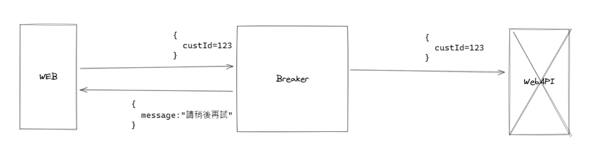

# Polly Demo

Blog:[polly-熔斷機制](https://partypeopleland.github.io/artblog/2022/04/20/polly-library-circuit-breaker/#more)

> 文章內容與 repo 相關，此處為另外的一個 POC 及測試

## intro

Web 透過 `httpClient` 向第三方取得資料有可能會因為服務失敗，而造成自身網站的使用者體驗問題


加入 `Polly Library` 所提供的斷路器策略，可以有效的改善這樣的問題



## 測試方法

1. 開啟 `WebApi` 專案，或者是自行透過`mock server`等其他方式建立一個用來接收請求的第三方服務
1. 開啟網站，透過`偵錯`啟動 Web 專案，稍後可於 `Debug Output` 檢視埋設的訊息
1. 開啟網站後查看首頁，可透過按鈕點選，送出 ajax 請求給 `web`，而 `web`的後端 `controller` 會再去呼叫 `httpClient` 向指定的第三方請求資源


## Polly 設定

### Polly 設定參數

```json
[
  {
    // 設定檔名稱
    "PolicyName": "default",
    // 設定的策略
    "PolicyWrap": ["circuitBreaker", "timeout"],
    // Timeout 設定
    "TimeoutConfig": {
      "TimeoutSeconds": 2
    },
    // 斷路器設定
    "CircuitBreakerConfig": {
      // 發生幾次例外之後斷路
      "ExceptionsAllowedBeforeBreaking": 2,
      // 斷路時間(秒)
      "DurationOfBreak": 10
    },
    // 進階斷路器設定
    "AdvancedCircuitBreakerConfig": {
      // 斷路時間(秒)
      "DurationOfBreak": 10,
      // 取樣時間內最少要有幾次請求才算
      "MinimumThroughput": 8,
      // 取樣時間(秒)
      "SamplingDuration": 4,
      // 異常比例，(以 1 表示 100%；0.5表示 50%)
      "FailureThreshold": 0.5
    }
  }
]
```

### Client 對照設定組

這個設定檔存放的是 Client 檔案要使用哪一組設定

```json
// PollyDemo.B2C.Web/_config/policy.lookup.config.json
[
  {
    // client's nameSpace
    "ClassName": "PollyDemo.B2C.DataService.DAC.MyClient",
    // 設定檔名稱
    "PolicyName": "default"
  }
]
```
